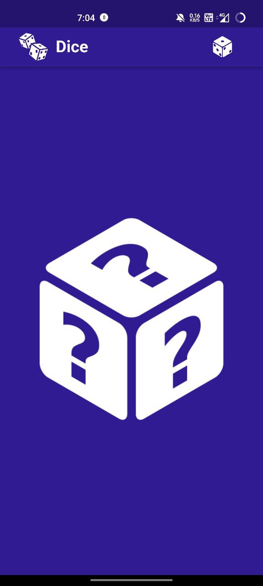
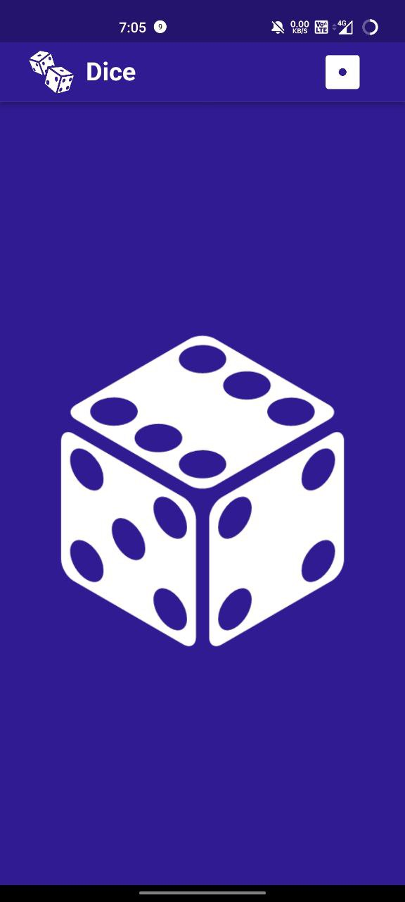
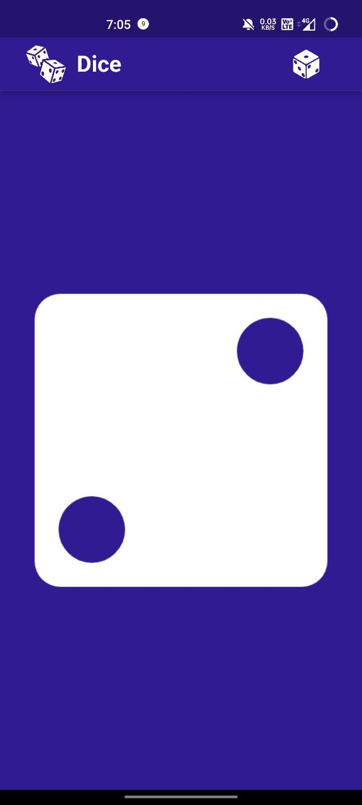

# Dice APP

The Dice App is a user-friendly and entertaining application that has been created using the Flutter framework. Its main purpose is to mimic a set of dice and generate random numbers when used by the user. Additionally, it offers two distinct dice views that users can choose from based on their personal preference.

By rolling virtual dice, the app generates random numbers ranging from 1 to 6, and displays them as a visual dice image on the screen. This straightforward yet effective functionality makes it an excellent substitute for traditional physical dice.

---

 - Watch the [video](https://drive.google.com/file/d/1FP1_fj2cTUZSnGL7fB2qfmm_7attJ3Y4/view?usp=sharing) of the application
 - Click here to [download](https://drive.google.com/file/d/1UrB5Fp6TCJ0pPK5k6aasEkrmtI5ShStk/view?usp=sharing) Application
### APP Video: 
https://drive.google.com/file/d/1FP1_fj2cTUZSnGL7fB2qfmm_7attJ3Y4/view?usp=sharing

### APP apk:
https://drive.google.com/file/d/1UrB5Fp6TCJ0pPK5k6aasEkrmtI5ShStk/view?usp=sharing

## Preview

  
  
  

